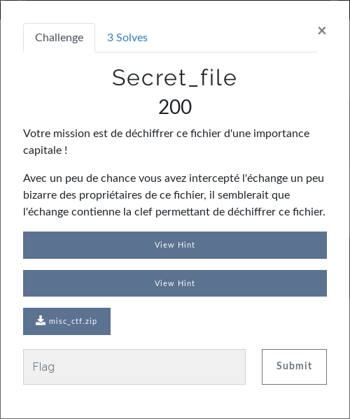
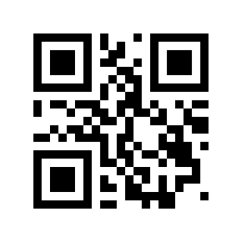

# Misc - Secret_file
  
Comme je suis resté bloqué pendant le challenge, j'ai acheté les 2 indices :  
1. aes-256-cbc
2. openssl peut devenir ton ami :)
On télécharge le fichier puis on le dézippe.  
Un petit `file *` :
```
$ file *
flag:    openssl enc'd data with salted password
key.txt: ASCII text
```
Donc on a le flag qui est chiffré et "key.txt" qui contient du texte.
```
$ cat key.txt 
KysrKysrKysrK1s+Kz4rKys+KysrKysrKz4rKysrKysrKysrPDw8PC1dPj4+LS0tLS0tLS0tLS0tLS0tLi0tLjwrKy4+LS4rKysrLjwuPi0tLS0tLS0uLisrKy48Lj4uKysrKy48Lj4tLS0tLS0tLi4tLjwuPisrKysrKysrKy4tLS48Lj4tLS0tLS0uLisrKysrKysuPC4+LS0tLS0tLS4tLisrKysrLjwuPi0tLS0uLisrKy48Lj4tLS0uLisrKysrKy48Lj4tLS0tLS0uLisrKysu
```
Du base64, on décode : 
```
$ cat key.txt | base64 -d
++++++++++[>+>+++>+++++++>++++++++++<<<<-]>>>---------------.--.<++.>-.++++.<.>-------..+++.<.>.++++.<.>-------..-.<.>+++++++++.--.<.>------..+++++++.<.>-------.-.+++++.<.>----..+++.<.>---..++++++.<.>------..++++.
```
Il se peut qu'on ne sache pas ce que cela signifie, on fait donc une recherche sur internet avec ce que l'on vient de trouver et on tombe sur [ce site](https://www.dcode.fr/brainfuck-language).  
On colle ce que l'on vient de trouver et le site nous ressort : "75 48 114 48 110 97 118 105 114 117 115".  
Ca ressemble à du texte retranscrit en décimal. On le décode avec python :  
```
$ python3
>>> a = "75 48 114 48 110 97 118 105 114 117 115"
>>> a = a.split()
>>> a
['75', '48', '114', '48', '110', '97', '118', '105', '114', '117', '115']
>>> for lettre in a:
...     print(chr(int(lettre)))
... 
K
0
r
0
n
a
v
i
r
u
s
```
On obtient "K0r0navirus". On a donc maintenant un fichier chiffré et ce qui semble être un mot de passe.  
On regarde les hints : 
1. aes-256-cbc
2. openssl peut devenir ton ami :)
On sait alors que le flag est chiffré avec AES 256 bits en mode CBC.  
On teste avec openssl :  
```
$ openssl enc -aes-256-cbc -d -in flag -out flag.txt
enter aes-256-cbc decryption password:
```
On entre "K0r0navirus" et openssl nous ressort le fichier flag.txt.  
Ca y est !  
```
$ cat flag.txt
[...] plein de caractères illisibles...
```
Fausse joie. Un petit file sur le fichier : 
```
$ file flag.txt
flag.txt: PNG image data, 300 x 300, 8-bit/color RGBA, non-interlaced
$ # c'est donc une image, on l'affiche
$ display flag.txt
```
  
C'est un QR code, on le scan : [](https://webqr.com/)  
  
**FLAG : BC{_G00DJ0B_}**